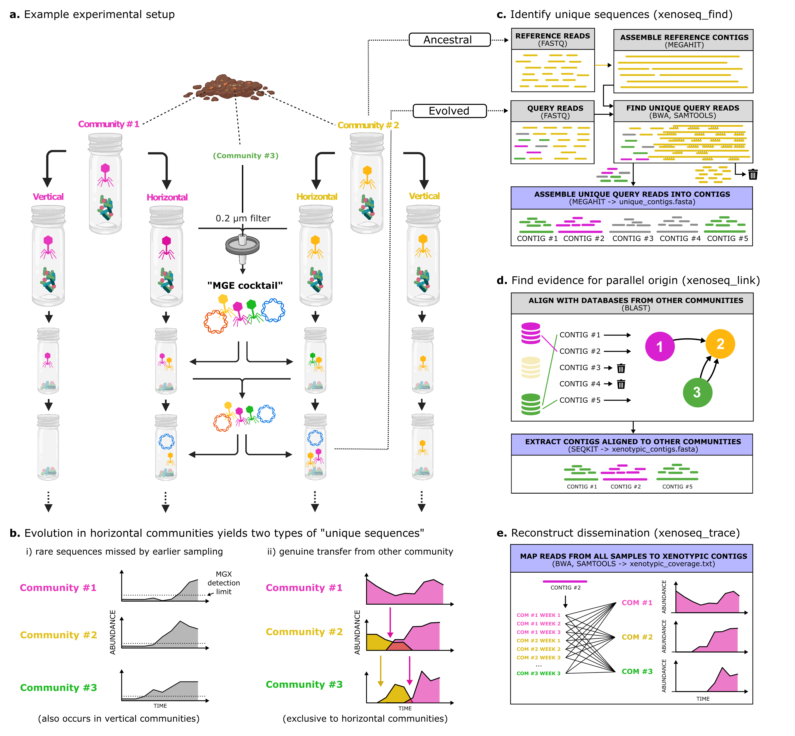

# Xenoseq

```
	 __    __                                                             
	/  |  /  |                                                            
	AT |  GC |  ______   _______    ______    _______   ______    ______  
	GG  \/AG/  /      \ /       \  /      \  /       | /      \  /      \ 
 	TA  TT<  /GATACT  |TAAATGG  |/CCGTAA  |/AATAAAS/ /ATTTCT  |/ATGTTA  |
	  TGAC  \ AA    GA |TG |  GG |AG |  AG |TT      \ TT    CG |GA |  AT |
	 AA /AT  |GATCCCGT/ TA |  AA |CG \__AG | GGAACT  |TACGGGTA/ GT \__AT |
	AA |  GC |CC       |GA |  GT |GC    GT/ /     GG/ TA       |AG    AT |
	GG/   TG/  GTAGGCC/ CA/   TT/  TAAATG/  ATGCGCG/   ATGCAAT/  AGGGTTT |
	                                                                  AA |
	                                                                  AA |
 	                                                                  AA/ 
```

Xenoseq is a simple bioinformatic pipeline to find sequences that appear to be newly
introduced into a community. The input are (sets of) query and reference samples,
which the pipeline will use to generate the following output:

* unique_contigs.fasta; sequences in query not present in reference (e.g. ancestral) samples
* unique_coverage.txt; text file to estimate abundance of unique sequences in all other samples
* unique_contig_all_links_L300_P97.tbl; table linking contigs to other communities using BLAST, with options L and P in the filename
* xenotypic_contigs.txt; text file with names of all xenotypic contigs in them
* xenotypic_contigs.fasta; the subset of unique contigs that can be linked to *another* reference using BLAST
* xenotypic_coverage.txt; text files to estimate the abundance of xenotypic sequences in non-ancestral samples
* source_contigs; fasta files from reference samples that are themselves / are linked to MGEs

## Overview
Xenoseq wraps read trimming (fastp), assembly (megahit), read mapping (BWA), read filtering (samtools), and local alignment (blast), to detect putative evidence
of horizontal transfer between communities. This tool was used in a recent publication
(<preprint_available_soon>) to detect the movement of MGEs and nanobacteria in compost communities. (see Figure below for the experimental setup and subroutines in Xenoseq)



## Install: conda setup (required)
To use xenoseq, a conda environment file is provided to install the above mentioned
dependencies (for information on conda, see docs.conda.io/projects/conda/en/latest/)

To install the xenoseq environment, simply use:

```
git clone https://github.com/bramvandijk88/xenoseq.git
cd xenoseq
conda env create -f environment.yml
conda activate xenoseq
```

## Install: add to path (optional quality-of-life improvement)

To run the pipeline, you either have to provide the full path to
the xenoseq binary (e.g. /home/user/XENOSEQ_DIR/xenoseq, or
add the xenoseq directory (where you cloned the repository)
to your global PATH variable:

```
export PATH='$PATH:<XENOSEQ_DIR>'
```

e.g. if you cloned / downloaded xenoseq into your home dir:

```
export PATH='$PATH:~/xenoseq'
```

If you don't want to do this each time you login to a new
terminal, add the export PATH code to you ~/.bashrc
(or ~/.profile) file:

```
echo export PATH='$PATH:~/xenoseq' >> ~/.bashrc
```

## Metadata file

Usage of the pipeline requires a file listing all the "queries" and "subjects" in a
text file. The pipeline will look for unique reads in the query files by comparing
them to the corresponding subjects. These reads will be assembled into contigs. A
subset of these contigs will be "xenotypic", i.e. having a foreign origin, by
aligning the sequences to the remaining subjects, providing extra evidence for
horizontal transfer of viral sequences or genes.

The metadata should look like this:

```
# SAMPLES (Query, Reference)
Horizontal1	Ancestral1
Horizontal2	Ancestral2
Horizontal3	Ancestral3
Horizontal4	Ancestral4
Vertical1	Ancestral1
Vertical2	Ancestral2
Vertical3	Ancestral3
Vertical4	Ancestral4
```

To run the pipeline (e.g. on the example data), use one of the following commands:
```
> ./xenoseq -m example_metadata.tsv -o Xenoseq_example -l -t            # Full pipeline
> ./xenoseq -m example_metadata.tsv -o Xenoseq_example                  # Only identify unique sequences
> ./xenoseq -m example_metadata.tsv -o Xenoseq_example -t      		# Identify and trace unique sequences
> ./xenoseq -m example_metadata.tsv -o Xenoseq_example -l -f -P 99.99   # Force a relinking of unique-xenotypic with stricter percent identity 
```

This example will use mock reads found in samples/reads and will search for xenotypic contigs in simulated data. Your unique/xenotypic contigs will then be
stored in Xenoseq_example/<QUERY>. By default, xenoseq will assume your reads will
be stored in /samples/reads, and will assume the files correspond to the names
in the metadata file with the suffix \"\_R1.fq\" and \"\_R2.fq\" (these options
can be changed with -p and -r). In other words; if you have your own reads you need to
modify the metadata (and optionally, modify the read path/prefix). 

The usage of the trace option (-t) will ensure all samples will be mapped back 
to the unique contigs and generate coverage statistics. 

## All options
```bash

Usage:
         xenoseq -m <meta_data_tsv> -o <output_dir> -c <num_cores> -l -t
Mandatory:
        -m/--metadata           File containing the metadata (tsv file with query-reference sets)
Optional options:
        -p/--path_to_reads <STRING>     Path to reads for samples in metadata (default = samples/reads)
        -r/--read_suffix <STRING>       Read suffix corresponding to metadata n ames (e.g. when read filenames are Sample1_R1.fq and Sample1_R2.fq, use _R*.fq) (default = _R*.fq)
        -l/--link                       After detecting unique contigs, attempt to link them to other reference samples.
        -t/--trace                      After detecting xenotypic contigs, trace them across all samples.
        -c/--cores <INT>                Number of CPUs to use for smaller tasks (passed on to bwa, samtools, etc.) (default = 4)
        -C/--assembly_cores <INT>               Number of CPUs to use for assembly (megahit) (default = 4)
        -j/--jobs  <INT>                Maximum number of parallel jobs (default = 4)
        -J/--max_assembly_jobs  <INT>   Maximum number of parallel jobs for assembly (default = )
        -o/--output <STRING>            Output directory to put all the data
        -L/--alignment_length           Minimal alignment length to link unique sequences to other reference samples.
        -S/--single_end <STRING>        Assume single-end reads (e.g. use only Sample1_R1.fq and skip read merging)
        -P/--alignment_pid              Minimal percent identity to link unique sequences to other reference samples.
        -f/--force_relink               Link unique sequences to reference samples, even when this step is already performed.

```

If you want to modify any more options (e.g. filtering thresholds, quality trimming),
you can modify the relevant subroutines of xenoseq given in xenoseq_bin/functions.sh.

```

xenoseq -h

Xenoseq was tested on MAC Monterey 12.5.1 and Ubuntu 20.04.3 (also available on as Windows subsystem)

```
